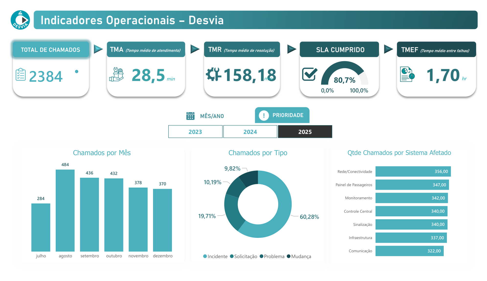
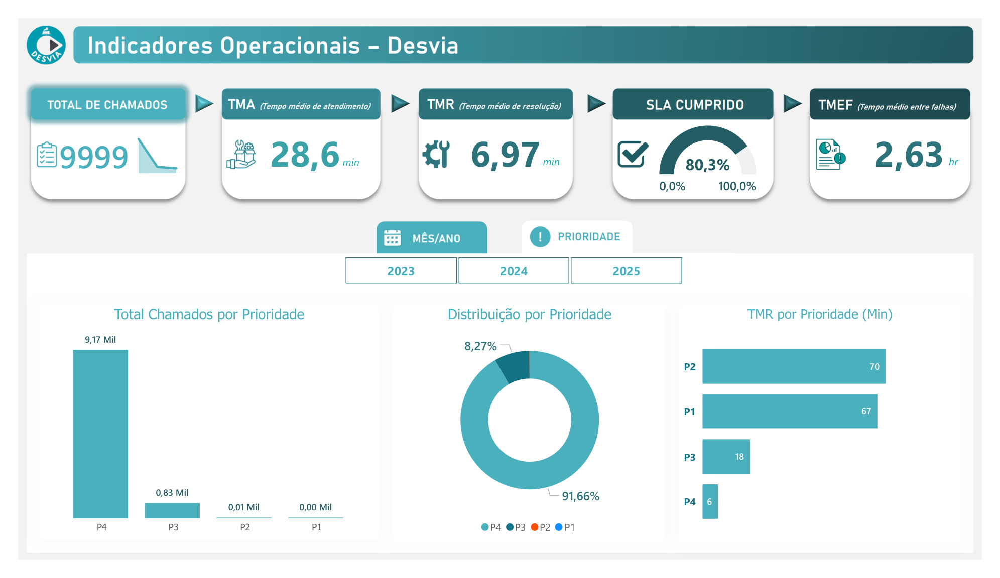
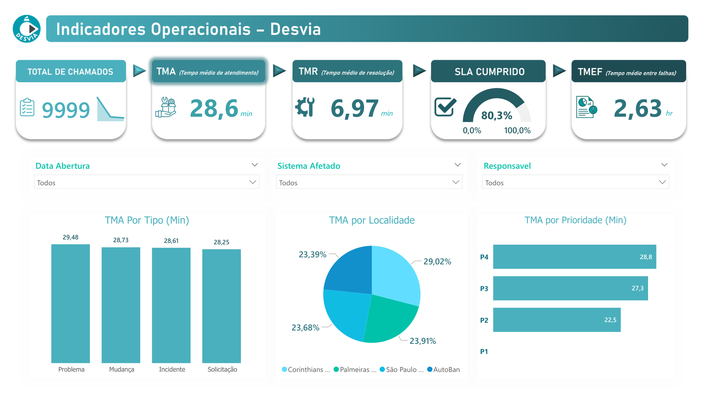
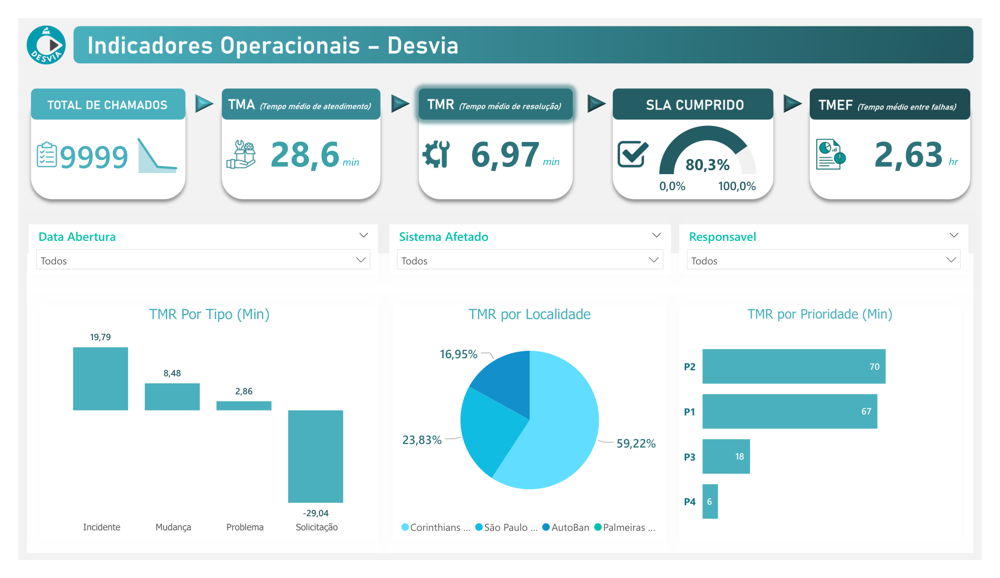
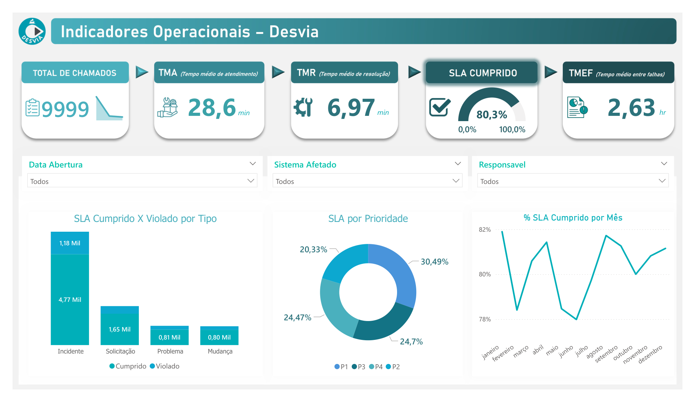
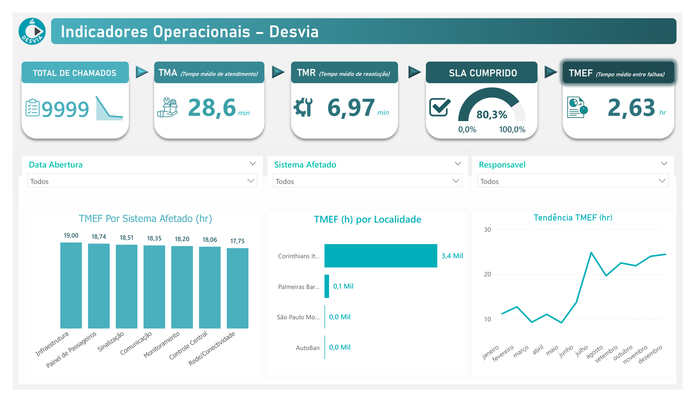

# Desvia — Dashboard de Gestão de Incidentes de TI

Dashboard de Business Intelligence desenvolvido em **Power BI** para monitoramento e análise de incidentes e operações de Tecnologia da Informação.

O projeto centraliza informações operacionais e apresenta indicadores relacionados a **atendimento, resolução, SLA, reincidência e desempenho dos sistemas**, permitindo uma visão mais estruturada dos incidentes.

## Contexto

O Desvia foi desenvolvido com o objetivo de transformar dados operacionais de incidentes de TI em informações visuais e acionáveis.

A solução permite acompanhar o comportamento dos incidentes ao longo do tempo e analisar os principais indicadores operacionais por diferentes dimensões, como **prioridade, sistema afetado, responsável, localidade e tipo de ocorrência**.

## Estrutura do Dashboard

O relatório é organizado em diferentes visões analíticas:

- Home
- Ano/Mês
- Prioridade
- TMA
- TMR
- SLA
- TMEF

## Dashboard

### Visão Geral

### Prioridade

### TMA

### TMR

### SLA

### TMEF

## Indicadores

O dashboard apresenta indicadores como:

- Total de chamados
- TMA — Tempo Médio de Atendimento
- TMR — Tempo Médio de Resolução
- TMEF — Tempo Médio Entre Falhas
- SLA cumprido
- LA violado
- Incidentes reincidentes

## Análises

O Desvia permite analisar os dados sob diferentes perspectivas:

- Evolução dos incidentes ao longo do tempo
- Distribuição por prioridade
- Análise de TMA
- Análise de TMR
- Cumprimento de SLA
- Tempo entre falhas
- Sistemas afetados
- Tipos de ocorrência
- Responsáveis
- Localidades
- Unidades de negócio

## Tecnologias

- Power BI
- Power Query
- DAX
- Modelagem de dados
- Data Visualization

## Dados

A solução utiliza uma base de dados fictícia, desenvolvida para fins de demonstração e análise.

A base contém informações relacionadas a incidentes, solicitações, problemas e mudanças, incluindo dados de prioridade, status, atendimento, resolução, SLA, sistemas afetados e demais atributos operacionais.

## 🏆 Reconhecimento

Este projeto recebeu um Certificado de Reconhecimento e Excelência concedido pela Faculdade Impacta, no contexto da disciplina de Gestão de Projetos de TI.

O reconhecimento foi concedido em 08 de dezembro de 2025, durante o 2º semestre do Bacharelado em Sistemas de Informação, em reconhecimento ao destaque apresentado no projeto.

  

